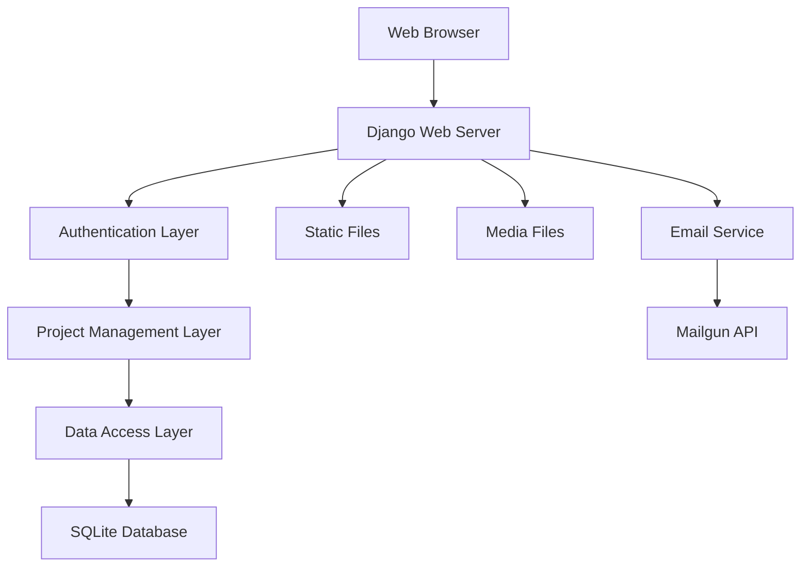
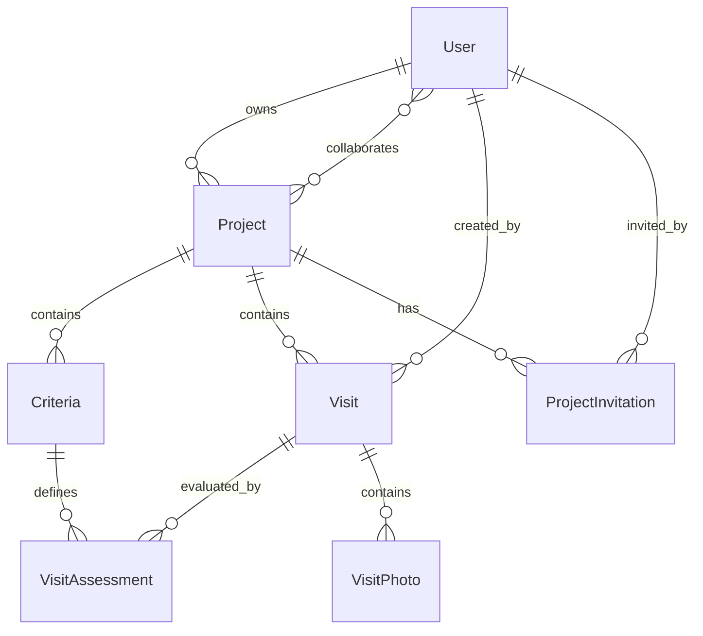

# Housing Evaluation System Design Document

## Overview

The Housing Evaluation System is a Django-based web application that provides a mobile-first interface for evaluating and comparing housing options. The system uses a multi-tenant architecture where users can create projects, invite collaborators, and systematically evaluate properties using customizable criteria.

## Architecture

### High-Level Architecture



### Technology Stack

- **Backend Framework**: Django 5.2+ with Python 3.13+
- **Database**: SQLite (development and production). In data folder
- **Authentication**: Django Allauth
- **Frontend**: Django Templates + Tailwind CSS (CDN)
- **Interactivity**: HTMX for dynamic updates
- **Email**: Mailgun API integration
- **Package Management**: uv
- **File Storage**: Local filesystem for media uploads

### Application Structure

```
checklistcasa/
├── core/                    # Main Django project
│   ├── settings/
│   │   ├── base.py
│   │   ├── development.py
│   │   └── production.py
│   ├── urls.py
│   └── wsgi.py
├── projects/                # Project management app
├── accounts/                # User management and authentication
├── static/                  # Static assets
├── media/                   # User uploads
└── templates/               # Global templates
```

## Components and Interfaces

### Core Applications

#### 1. Projects App
- **Purpose**: Manages projects, criteria, visits, and assessments
- **Models**: Project, Criteria, Visit, VisitAssessment, ProjectInvitation
- **Views**: Project CRUD, collaboration management, comparison tables
- **Templates**: Dashboard, project detail, visit forms, comparison views

#### 2. Accounts App
- **Purpose**: User authentication and profile management
- **Integration**: Django Allauth for social auth and email verification
- **Views**: Login, signup, profile management
- **Templates**: Authentication forms, user dashboard

### Key Interfaces

#### Project Management Interface
- Dashboard showing active and finished projects
- Project creation and settings management
- Team collaboration and invitation system
- Project lifecycle controls (finish/archive)

#### Visit Logging Interface
- Mobile-optimized multi-step form
- Dynamic criteria presentation based on project setup
- Photo upload with preview
- Progress saving and validation

#### Comparison Interface
- Responsive table with sorting and filtering
- Color-coded assessment visualization
- Export functionality (CSV/PDF)
- Mobile-friendly card view for small screens

## Data Models

### Core Models

```python
# Project Model
class Project(models.Model):
    name = models.CharField(max_length=200)
    owner = models.ForeignKey(User, on_delete=models.CASCADE, related_name='owned_projects')
    collaborators = models.ManyToManyField(User, related_name='collaborated_projects', blank=True)
    status = models.CharField(max_length=20, choices=[('active', 'Active'), ('finished', 'Finished')])
    created_at = models.DateTimeField(auto_now_add=True)
    finished_at = models.DateTimeField(null=True, blank=True)

# Criteria Model
class Criteria(models.Model):
    project = models.ForeignKey(Project, on_delete=models.CASCADE, related_name='criteria')
    name = models.CharField(max_length=100)
    type = models.CharField(max_length=20, choices=[
        ('boolean', 'Yes/No'),
        ('numeric', 'Number'),
        ('text', 'Text'),
        ('rating', 'Rating 1-5')
    ])
    weight = models.DecimalField(max_digits=3, decimal_places=2, null=True, blank=True)
    order = models.PositiveIntegerField(default=0)

# Visit Model
class Visit(models.Model):
    project = models.ForeignKey(Project, on_delete=models.CASCADE, related_name='visits')
    name = models.CharField(max_length=200)
    address = models.TextField()
    realtor_name = models.CharField(max_length=100, blank=True)
    realtor_contact = models.CharField(max_length=100, blank=True)
    visit_date = models.DateField()
    notes = models.TextField(blank=True)
    created_by = models.ForeignKey(User, on_delete=models.CASCADE)
    created_at = models.DateTimeField(auto_now_add=True)

# Visit Assessment Model
class VisitAssessment(models.Model):
    visit = models.ForeignKey(Visit, on_delete=models.CASCADE, related_name='assessments')
    criteria = models.ForeignKey(Criteria, on_delete=models.CASCADE)
    value_text = models.TextField(blank=True)
    value_numeric = models.DecimalField(max_digits=10, decimal_places=2, null=True, blank=True)
    value_boolean = models.BooleanField(null=True, blank=True)
    value_rating = models.IntegerField(null=True, blank=True, validators=[MinValueValidator(1), MaxValueValidator(5)])

# Visit Photo Model
class VisitPhoto(models.Model):
    visit = models.ForeignKey(Visit, on_delete=models.CASCADE, related_name='photos')
    image = models.ImageField(upload_to='visit_photos/')
    caption = models.CharField(max_length=200, blank=True)
    order = models.PositiveIntegerField(default=0)

# Project Invitation Model
class ProjectInvitation(models.Model):
    project = models.ForeignKey(Project, on_delete=models.CASCADE, related_name='invitations')
    email = models.EmailField()
    invited_by = models.ForeignKey(User, on_delete=models.CASCADE)
    token = models.UUIDField(default=uuid.uuid4, unique=True)
    accepted = models.BooleanField(default=False)
    created_at = models.DateTimeField(auto_now_add=True)
```

### Model Relationships



## Error Handling

### Validation Strategy

#### Model-Level Validation
- Criteria type validation ensures assessment values match expected types
- Photo upload limits (max 5 per visit, file size restrictions)
- Project status transitions (only owners can finish projects)
- Assessment value validation based on criteria type

#### Form-Level Validation
- Email validation for invitations
- Required field validation for visit creation
- File type and size validation for photo uploads
- Cross-field validation for assessment forms

#### Permission-Based Error Handling
- Project access control (members only)
- Owner-only operations (finish project, manage invitations)
- Finished project write protection
- Graceful handling of unauthorized access attempts

### Error Response Strategy

#### User-Friendly Messages
- Clear validation error messages in forms
- Success notifications for completed actions
- Warning messages for destructive operations
- Progress indicators for multi-step processes

#### Technical Error Handling
- Database constraint violation handling
- File upload error management
- Email delivery failure handling
- Session timeout and authentication errors

## Testing Strategy

### Unit Testing Approach

#### Model Testing
- Model validation and constraint testing
- Relationship integrity testing
- Custom model method testing
- Database query optimization testing

#### View Testing
- Authentication and permission testing
- Form submission and validation testing
- Template rendering and context testing
- AJAX endpoint testing for HTMX interactions

#### Integration Testing
- End-to-end user workflows
- Email invitation flow testing
- File upload and storage testing
- Multi-user collaboration scenarios

### Test Data Management

#### Fixtures and Factories
- User account fixtures for different roles
- Project templates with sample criteria
- Visit data with various assessment types
- Photo upload test files

#### Test Database Strategy
- Isolated test database for each test run
- Transaction rollback for test isolation
- Performance testing with larger datasets
- Migration testing for schema changes

### Mobile Testing Considerations

#### Responsive Design Testing
- Cross-device compatibility testing
- Touch interface interaction testing
- Mobile form usability testing
- Performance testing on mobile networks

#### Offline Capability Testing
- Form data persistence during connectivity issues
- Progressive enhancement validation
- Graceful degradation testing
- Cache strategy effectiveness testing

## Security Considerations

### Authentication and Authorization
- Django Allauth integration for secure authentication
- Session-based authentication with secure cookies
- CSRF protection on all forms
- Permission-based access control for projects

### Data Protection
- Input sanitization and validation
- SQL injection prevention through ORM usage
- XSS protection through template escaping
- File upload security (type validation, size limits)

### Privacy and Data Handling
- User data isolation by project membership
- Secure file storage with access controls
- Email invitation token security
- Data retention policies for finished projects

## Performance Optimization

### Database Optimization
- Efficient query design with select_related and prefetch_related
- Database indexing for frequently queried fields
- Pagination for large datasets
- Query optimization for comparison tables

### Frontend Performance
- Tailwind CSS purging for minimal CSS bundle
- Image optimization and lazy loading
- HTMX for efficient partial page updates
- Minimal JavaScript footprint

### Caching Strategy
- Template fragment caching for comparison tables
- Static file caching with proper headers
- Database query result caching for expensive operations
- Session-based caching for user-specific data